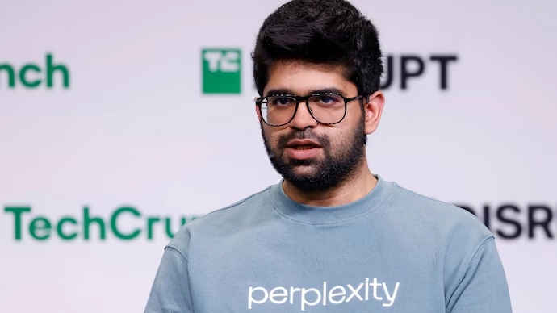

# Perplexity AI Browser Comet：这个AI工具可能要取代招聘和助理了

---

你有没有想过，有一天你的招聘专员或行政助理会被一个浏览器替代？听起来像科幻小说，但Perplexity AI的CEO最近就公开说了：我们的新产品Comet，就是冲着这两个岗位来的。这不是危言耸听，而是AI工具正在悄悄改变办公室游戏规则的真实信号。如果你正在用传统方式处理日程、邮件和招聘，可能是时候看看[Perplexity这样的AI工具](https://pplx.ai/ixkwood69619635)能帮你省多少时间了。

---

## AI行业又搞了个大动作

Perplexity AI的CEO Aravind Srinivas最近上了The Verge的播客节目，聊到他们的新产品Comet时，直接放了个大招：这玩意儿不是普通的AI聊天工具，它是个能干活的"数字员工"。

他说得很直白——Comet瞄准的就是两类白领岗位：招聘专员和行政助理。

这话一出，整个科技圈又开始吵起来了。有人说AI只是辅助工具，有人说它正在抢饭碗。但不管怎么说，Comet的出现确实让人开始认真思考：我的工作会不会被AI替代？

## Comet到底是个什么东西？

简单说，**Perplexity AI Browser Comet不是那种你问它问题、它给你答案的AI助手**。它更像是一个能自己干活的员工，在后台默默帮你处理各种琐事。

它能直接连接Gmail、Google日历、LinkedIn和Google表格这些你每天都在用的工具。关键是，它不需要你一步步告诉它怎么做——你只要给它一个指令，它就能自己把整个流程走完。

比如说，你想招个人。传统方式是：你去LinkedIn找候选人，复制联系方式，写邮件，发出去，等回复，更新表格，安排面试……一套流程下来，少说也得几个小时。

但用Comet呢？你只要说一句"帮我找10个符合XX条件的候选人并发邮件"，它就能把这一整套活儿干完。Srinivas的原话是："**招聘专员一周的工作，现在一个提示就能搞定。**"

听起来有点吓人，对吧？

## 它和其他AI工具有什么不同？

你可能会说，ChatGPT、Copilot这些工具不也能帮忙吗？

区别在于，**Comet不只是给建议，它会直接动手**。

**对行政助理来说：**  
Comet能管理日程、准备会议材料、整理任务清单、解决时间冲突、优先处理邮件——这些都是行政助理每天在做的事。现在，[Perplexity的这个工具](https://pplx.ai/ixkwood69619635)能自动完成。

**对招聘专员来说：**  
它能从LinkedIn挖人、提取联系方式、写招聘邮件、跟进回复、更新候选人表格、准备面试简报——整个招聘流程，它都能接手。

这就是为什么Srinivas敢说，Comet是个"AI操作系统"，而不只是个搜索工具。

## 白领工作真的要被AI抢了吗？

其实不只是Perplexity在说这个事儿。最近好几个科技大佬都在谈AI对办公室工作的冲击：

- **Anthropic的CEO Dario Amodei**预测，未来五年内，**50%的初级办公室岗位可能会消失**。
- **福特CEO Jim Farley**也说，美国有一半的白领岗位面临威胁。
- **亚马逊CEO Andy Jassy**直接告诉员工：赶紧学会用AI，不然就等着被淘汰。
- **英伟达的Jensen Huang**倒是乐观一些，他觉得AI会改变工作方式，但不会完全消灭岗位。
- **Salesforce的Marc Benioff**强调，AI是用来增强人的能力，不是替代人。

不管他们怎么说，有一点是肯定的：**AI正在模糊人和机器之间的界限**。

## 为什么Comet这么重要？

OpenAI在搞能自己操作电脑的AI代理，而Perplexity的Comet则走了另一条路——它不是虚拟操作一台电脑，而是**直接融入你每天用的工具里**。

这意味着什么？意味着它不是个"外挂"，而是个"内置员工"。它不需要你切换界面、复制粘贴、手动操作——它就在你的Gmail、日历、表格里，默默把活儿干了。

这种设计让Comet看起来更像是**下一代生产力工具的雏形**：不是帮你查信息，而是帮你把事情做完。

## 别再刷手机了，学点AI吧

Srinivas在采访里还说了一段挺有意思的话。他说，现在的职场正在分化成两类人：**会用AI的和不会用AI的**。

他的原话是：

> **"那些掌握AI工具的人，肯定比不会用的人更容易找到工作。这是板上钉钉的事。"**

他还劝大家别把时间浪费在刷Instagram上，赶紧去学学怎么用AI工具——不是为了帮老板省钱，而是为了自己的未来。

他也承认，AI的进步速度确实快得吓人，每隔三到六个月就有新东西出来，让人应接不暇。但他觉得，**适应AI的人会活得更好，抗拒的人只会被甩在后面**。

这话听起来有点残酷，但仔细想想，好像也没错。

## AI到底是创造工作还是毁掉工作？

当然，不是所有人都同意Srinivas的说法。有些人认为，**AI会创造和它消灭的一样多的工作机会**——比如AI管理、AI伦理、AI监督这些新岗位。

但也有人担心，AI的发展速度太快了，社会根本来不及重新培训那些被替代的工人。

不管怎么说，有一点是确定的：**AI正在接手那些以前被认为"只有人能做"的复杂任务**。

## Comet接下来会怎么样？

目前，Comet还只是邀请制，只有付费用户才能用。但它的长期目标很明确：**成为办公室工作的AI操作系统**。

这意味着它会和更多企业工具深度整合，不只是招聘和日程管理，还会覆盖更广泛的业务流程。

如果Comet成功了，它可能会逼着传统软件公司重新思考：生产力工具到底该怎么设计？

## 你该怎么办？

**Perplexity AI Browser Comet会不会完全取代招聘和助理？**现在还不好说。但有一点是肯定的：**AI已经在减少这些岗位的人力需求了**。

如果你正在做这些工作——或者任何白领工作——最好的策略就是：**学会和AI一起工作**。

那些会用AI的人，可能会在管理、优化和创新这些技术上找到新机会。那些拒绝学习的人，可能真的会被自动化浪潮甩在后面。

随着[Comet和类似的AI工具](https://pplx.ai/ixkwood69619635)不断进化，职场本身正在经历数字时代最大的一次变革。这场变革会导致大规模失业，还是会带来生产力的新高峰？很大程度上取决于我们怎么应对。

---

## 总结：Comet不只是个浏览器，它是个警钟

**Perplexity AI Browser Comet的出现**说明了一个更大的事实：**AI不是未来才会抢工作——它已经在改变我们今天的工作方式了**。对招聘专员、行政助理和无数其他办公室工作者来说，信号已经很明确了。要么适应AI，要么被AI替代。如果你还在用传统方式处理这些工作，不妨试试[Perplexity这样的AI工具](https://pplx.ai/ixkwood69619635)，看看它能帮你省多少时间——毕竟，与其担心被替代，不如先学会怎么用它。
